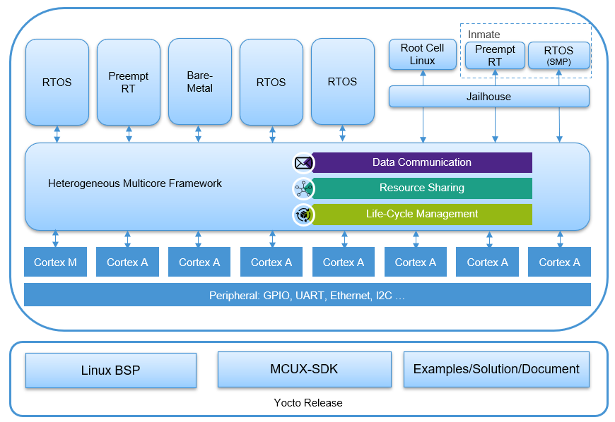

# Heterogeneous Multicore


# Overview

Heterogeneous Multicore Framework provides a general software framework to support Heterogeneous AMP. It enables AMP to be inter-connected and provides a unified resource management and life-cycle management.



It provides the below key functions to help user to accelerate solution development based on multicore platforms:

1. Data communication between different operating systems

	The following technical can be used for pass common data between different OS, it can be between Cortex-M Core and Cortex-A Core, or between different Cortex-A Cores, or between multiple CPU Cores simulteneously.

   * RPMSG

	RPMSG is a standard inter-core communication protocol, it is supported on Linux and RTOS.

   * Heterogeneous Multicore VirtIO

	Heterogeneous Multicore VirtIO leverages para-virtualization VirtIO technology to build high performance inter-core data path, customerized data path is defined according to different usecases.

2. Resource sharing between different operating systems

	Resource sharing enables sharing the same physical resource between different OS. In general one OS owns and controls hardware resource while the other OS uses a virtual device. The following mechanism is followed to build the control path and data path to access physical resource.

   * RPMSG

	Use RPMSG to build control and data path crossing OS, physical resource is shared with another OS in terms of virtual device. Simplified Real-Time Messaging (SRTM) protocol provided in Real-time Edge is an implementation based on RPMSG. It is used to share the physical resources of Cortex-M core with Cortex-A core in terms of virtual device in Linux.
   * Heterogeneous Multicore VirtIO

	Heterogeneous Multicore VirtIO have a better performance than RPMSG, and it can also be used for resource sharing. POSIX compatible API can be used to access virtual device, and some existing VirtIO device drivers in Linux can be reused. Networking sharing is provided in Real-time Edge to share the same networking interface between multiple OSes.

3. Unified Life-Cycle Management

	Heterogeneous Multicore Framework provides unified Life Cycle Management both for Cortex-A Core and Cortex-M Core. 


# Applications

Multiple applications are in "apps" directory:

* hello_world

	hello_world application is to demonstrate flexible Real-time System on MPU platforms, multiple images provided can be used to run single or multiple RTOS on Cortex-A Core or Cortex-M with or without runing Linux simulteneously.

* RTOS Benchmark

   * rt_latency

    This is a benchmark application to measure the latency between hardware IRQ events and software actions including:
    • irq delay: time to enter in the software IRQ handler after a hardware IRQ occurs (hardware + IRQ vector latency)
    • irq to sched: time to enter in an RTOS task, scheduled by the IRQ handler (irq delay + RTOS scheduler)

* RPMSG Applications

	Heterogeneous Multicore Framework supports RPMSG communication between Real-time Systems on MPU Platforms, such as:
   * RPMSG between RTOS on Cortex-M Core and Linux on Cortex-A core
   * RPMSG between RTOS on Cortex-A Core and Linux on Cortex-A Core
   * RPMSG between RTOS on Cortex-A Core and RTOS on Cortex-A Core

	The following applications provides filed trail for RPMSG related features

   * rpmsg_str_echo

	This demo is to demonstrate building up multiple RPMSG endpoints between RTOS and Linux. For example, on i.MX 8M Plus EVK board, images provided in Real-time Edge can be used to run three RTOS rpmsg_str_echo applications on two Cortex-A Core and one Cortex-M Core, the other two Cortex-A Cores run SMP Linux, then each RTOS will establish three RPMSG Channels with Linux.

   * rpmsg_pingpong

	This demo is to demonstrate RPMSG communication between RTOS and RTOS, one is RPMSG master and the other is RPMSG slave.

   * rpmsg_perf

	rpmsg_perf is a tool to evaluate RPMSG bandwitdth performance between RTOS and Linux Kenel.

   * rpmsg_uart_sharing

	This application is to demonstrate sharing the peripheral resource (UART) from Cortex-M RTOS to Cortex-A Linux through the SRTM protocol based on RPMsg channel.

* Heterogeneous Multicore VirtIO Applications

   * virtio_perf

	virtio_perf is a tool to evaluate Heterogeneous Multicore VirtIO bandwidth performance between RTOS and Linux.

   * VirtIO Networking Sharing

	This application is to demonstrate how to use Heterogeneous Multicore VirtIO to share physical peripherals or other resource between different CPU Core or OS. The applicatons provides networking sharing, physical networking interface is controlled by Cortex-M Core or Cortex-A Core, then it is shared with Cortex-A Core on which virtual NIC device driver is provided in Linux, Heterogeneous Multicore VirtIO is used to established high performance data path between two sides.

* Networking Stack

   * lwip_ping

    This application is to demonstrate how to integrate the lwIP networking stack into FreeRTOS.

* Industrial Applications

   * digital_io

    EtherCAT SOEM digital_io example for IO control uses BECKHOFF EK1100 as EtherCAT slave and i.MX 8M Plus, i.MX 8M Mini, i.MX 93 boards as EtherCAT Master, EtherCAT Master controls LED status of EtherCAT Slave.

   * servo_motor

    EtherCAT SOEM servo_motor example uses Inovance SV680 servo as EtherCAT slave and i.MX 8M Plus, i.MX 8M Mini, i.MX 93 boards as EtherCAT Master, EtherCAT Master controls Inovance SV680 servo.

   * servo_motor_rt1180

    EtherCAT SOEM servo_motor_rt1180 example uses i.MX RT1180-EVK as EtherCAT slave and i.MX 8M Plus, i.MX 8M Mini, i.MX 93 boards as EtherCAT Master, EtherCAT Master sends EtherCAT frame to i.MX RT1180 to control motor.


# Getting Started

## Download

A cross compiler is required to build Cortex-A and Cortex-M applications, this project is compatible with the ARM GCC toolchain that you may download and install:

```bash
mkdir ~/toolchains/; cd ~/toolchains/
wget https://developer.arm.com/-/media/Files/downloads/gnu/12.2.rel1/binrel/arm-gnu-toolchain-12.2.rel1-x86_64-arm-none-eabi.tar.xz
tar xf arm-gnu-toolchain-12.2.rel1-x86_64-arm-none-eabi.tar.xz
wget https://developer.arm.com/-/media/Files/downloads/gnu/12.2.rel1/binrel/arm-gnu-toolchain-12.2.rel1-x86_64-aarch64-none-elf.tar.xz
tar xf arm-gnu-toolchain-12.2.rel1-x86_64-aarch64-none-elf.tar.xz
```
This project uses west to manage all related repos, west.yml provides the description and revision for other projects used by Heterogeneous Multicore. Install the following tools firstly in order to download and built the applications:

```bash
# Update environment
sudo apt update

# git
sudo apt install git

# python3
sudo apt install python3-pip

# west
pip3 install west
```

Use the following command to clone all the source code:

```bash
export revision=Real-Time-Edge-v2.9-202407
west init -m https://github.com/nxp-real-time-edge-sw/heterogeneous-multicore.git --mr ${revision} workspace
cd workspace
west update
```
Replace ${revision} with any Real-Time Edge release you wish to use, it can also be main if you want to use the latest release.

## Compile

### FreeRTOS
Building application on Cortex-M Core, for example, building network sharing backend firmware running on Cortex-M Core:

```bash
export ARMGCC_DIR=~/toolchains/arm-gnu-toolchain-12.2.rel1-x86_64-arm-none-eabi
export PATH=$PATH:~/toolchains/arm-gnu-toolchain-12.2.rel1-x86_64-arm-none-eabi/bin
cd ~/workspace/heterogenous-multicore/apps/virtio_net_backend/freertos/boards/evkmimx8mm_cm4/armgcc
$ ./build_release.sh
```

The backend firmware image "virtio_net_backend_cm4.bin" is in "release" directory.

Building application on Cortex-A Core, for example, building network sharing backend firmware running on Cortex-A Core:

```bash
export ARMGCC_DIR=~/toolchains/arm-gnu-toolchain-12.2.rel1-x86_64-aarch64-none-elf
cd ~/workspace/heterogeneous-multicore/apps/virtio_net_backend/freertos/boards/evkmimx8mm_ca53/armgcc_aarch64
./build_ddr_release.sh
```
The backend firmware image "virtio_net_backend_ca53.bin" is in directory "ddr_release"

### Zephyr
Building application on Cortex-A Core, for example, building Zephyr hello_world running on Cortex-A Core:

```bash
export ARMGCC_DIR=~/toolchains/arm-gnu-toolchain-12.2.rel1-x86_64-aarch64-none-elf
export Zephyr_DIR=~/workspace/zephyr
cd ~/workspace/heterogeneous-multicore/apps/hello_world/zephyr/boards/evkmimx8mm_ca53/armgcc_aarch64
./build.sh
```
Then the following binary Zephyr images are built out:
```bash
./build_RTOS2_RAM_CONSOLE/zephyr/hello_world_ca53_RTOS2_RAM_CONSOLE.bin
./build_RTOS3_RAM_CONSOLE/zephyr/hello_world_ca53_RTOS3_RAM_CONSOLE.bin
./build_RTOS3_UART2/zephyr/hello_world_ca53_RTOS3_UART2.bin
./build_RTOS0_UART4/zephyr/hello_world_ca53_RTOS0_UART4.bin
./build_RTOS1_RAM_CONSOLE/zephyr/hello_world_ca53_RTOS1_RAM_CONSOLE.bin
./build_RTOS0_RAM_CONSOLE/zephyr/hello_world_ca53_RTOS0_RAM_CONSOLE.bin
```

### Build with Helper Script

"build_apps.sh" in the root directory of "heterogeneous-multicore" can be used to build single or all application for all boards.
The following is help information for "build_apps.sh" tool:

```bash
./build_apps.sh [clean]                                        - build or clean all applications
./build_apps.sh [clean] [os] [board-list] [app-list] [core]    - build or clean specified applications
      - os: specify freertos or zephyr or both if no specified.
      - core: a-core or m-core
      - board-list: specify one or some or all boards if no specified: evkmimx8mm_ca53 evkmimx8mp_ca53 mcimx93evk_ca55 evkmimx8mm_cm4 evkmimx8mp_cm7 mcimx93evk_cm33
      - app-list: specify one or some or all applications if no specified: hello_world lwip_ping rpmsg_perf rpmsg_pingpong rpmsg_str_echo rpmsg_uart_sharing rt_latency soem_digital_io soem_servo virtio_net_backend virtio_perf
```
For example:
```bash
     ./build_apps.sh a-core                         -build all a-core FreeRTOS and Zephyr applications
     ./build_apps.sh a-core evkmimx8mp_ca53 zephyr  -build all a-core Zephyr applications on evkmimx8mp
     ./build_apps.sh m-core                         -build all m-core applications
     ./build_apps.sh a-core hello_world zephyr      -build all a-core Zephyr hello_world applications
     ./build_apps.sh clean                          -clean all applications
     ./build_apps.sh a-core clean                   -clean all a-core applications
     ./build_apps.sh m-core hello_world clean       -clean all m-core hello_world applications
```

Need to set toolchain enviroment variables "ARMGCC_DIR" firstly before using the tool, and set enviroment variables "Zephyr_DIR" for Zephyr building.
For example, use the tool to build all hello_world application on Cortex-M Core for all supported boards:
```bash
export ARMGCC_DIR=~/toolchains/arm-gnu-toolchain-12.2.rel1-x86_64-arm-none-eabi
cd ~/workspace/heterogeneous-multicore/
./build_apps.sh m-core hello_world
```
Use the tool to build all Zephyr application on Cortex-A Core for all supported boards:
```bash
export ARMGCC_DIR=~/toolchains/arm-gnu-toolchain-12.2.rel1-x86_64-aarch64-none-elf
export Zephyr_DIR=~/workspace/zephyr
cd ~/workspace/heterogeneous-multicore/
./build_apps.sh a-core zephyr
```
After executing the tool, all binary images built out can be found in the directory: "deploy/images"

# Running Multicore Applications

Take Multicore Networking Sharing as example.

## Running Multicore Networking Sharing

Running backend firmware on Cortex-M Core, execute the following command in uboot command line

```bash
# Loading the image if the image is copied to root FS example directory:
=> ext4load mmc 1:2 0x48000000 /examples/heterogeneous-multicore/virtio-net-backend-cm/release/virtio_net_backend_cm4.bin
# Or loading the image from tftp server
=> tftp 0x48000000 virtio_net_backend_cm4.bin;

# Boot Backend on Cortex-M Core
=> cp.b 0x48000000 0x7e0000 0x20000
=> bootaux 0x7e0000

# Then boot Linux Kernel:
=> setenv fdtfile imx8mm-evk-virtio-net-cm4.dtb
=> setenv mmcargs $mmcargs mem=2048MB clk_ignore_unused
=> run bsp_bootcmd
```

Or Running the backend on Cortex-A53 of i.MX8MM
Executing the following command in uboot command line:
```bash
# Loading the image if the image is copied to root FS example directory:
=> ext4load mmc 1:2 0x93c00000 /examples/heterogeneous-multicore/virtio-net-backend-ca/ddr_release/virtio_net_backend_ca53.bin
# Or loading the image from tftp server
=> tftp 0x93c00000 virtio_net_backend_ca53.bin

# Boot Backend on Cortex-A Core
=> dcache flush&& dcache off && icache flush && icache off
=> cpu 3 release 0x93c00000

# Then boot Linux Kernel:
=> setenv fdtfile imx8mm-evk-virtio-net-ca53.dtb
=> setenv mmcargs $mmcargs maxcpus=3 clk_ignore_unused
=> run bsp_bootcmd
```
When the Linux kernel bootup, use “ifconfig” and “ping” to check the networking works.

```bash
root@imx8mm-lpddr4-evk:~# ifconfig
eth0: flags=4163<UP,BROADCAST,RUNNING,MULTICAST>  mtu 1500
        inet 192.168.1.107  netmask 255.255.255.0  broadcast 192.168.1.255
	inet6 fd08:d7d5:e652::733  prefixlen 128  scopeid 0x0<global>
	inet6 fd08:d7d5:e652:0:201:2ff:fe03:405  prefixlen 64  scopeid 0x0<global>
	inet6 fe80::201:2ff:fe03:405  prefixlen 64  scopeid 0x20<link>
	ether 00:04:9f:00:01:02  txqueuelen 1000  (Ethernet)
	RX packets 54  bytes 5544 (5.4 KiB)
	RX errors 0  dropped 0  overruns 0  frame 0
	TX packets 143  bytes 20887 (20.3 KiB)
	TX errors 0  dropped 0 overruns 0  carrier 0  collisions 0

root@imx8mm-lpddr4-evk:~# ethtool -i eth0
driver: virtio_net
version: 1.0.0
firmware-version:
expansion-rom-version:
bus-info: b8400000.virtio_net
supports-statistics: yes
supports-test: no
supports-eeprom-access: no
supports-register-dump: no
supports-priv-flags: no

root@imx8mm-lpddr4-evk:~# ping 192.168.1.1
	PING 192.168.1.1 (192.168.1.1) 56(84) bytes of data.
	64 bytes from 192.168.1.1: icmp_seq=1 ttl=64 time=0.888 ms
	64 bytes from 192.168.1.1: icmp_seq=2 ttl=64 time=0.541 ms
	64 bytes from 192.168.1.1: icmp_seq=3 ttl=64 time=2.13 ms
	64 bytes from 192.168.1.1: icmp_seq=4 ttl=64 time=2.29 ms
	64 bytes from 192.168.1.1: icmp_seq=5 ttl=64 time=1.73 ms
```

Please refer to [Real-time Edge Software User Guide](https://www.nxp.com/design/software/development-software/real-time-edge-software:REALTIME-EDGE-SOFTWARE) for more details.
