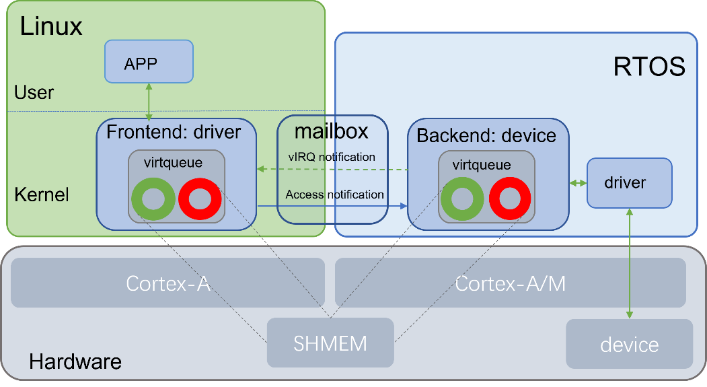
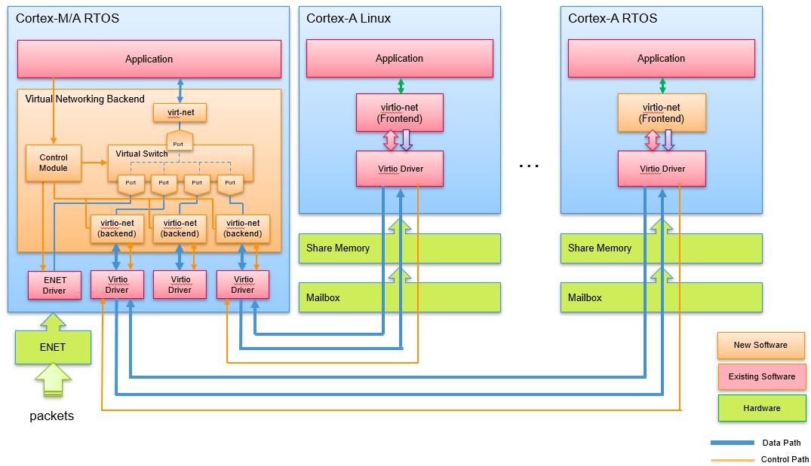

# Heterogeneous Multicore


# Overview

Heterogeneous Multicore Framework provides a framework for inter-core communication, resource sharing and resource assignment between the different Cores for AMP, and a unified building mechanism is also provided to compile all images running on different Cores.

Heterogeneous Multicore VirtIO is to leverage legacy VirtiIO technology to build inter-core communication and resource sharing between Heterogeneous AMP. It runs VirtIO backend on one Core, and runs VirtIO frontend on any other CPU Core, then uses VirtIO to establish communication between Frontend and Backend which run on different CPU Cores, so that hardware resource owned by backend can be shared with frontend. For the current implementation, the backend is running in RTOS, which owns the hardware resource, such as peripherals, and the frontend is running in Linux which can use hardware resource shared by backend by through virtual device drivers. The following figure shows the architecture of the Heterogeneous Multicore VirtIO.



Heterogeneous Multicore VirtIO Networking Sharing is based on Heterogeneous Multicore VirtIO to share the Ethernet owned by one of the Core to any other Cores. The sample application runs frontend in Linux on Cortex-A Core, and runs backend in FreeRTOS on Cortex-A Core or Cortex-M Core. The backend owns and controls ENET physical networking interface, the frontend provides a virtual networking interface which is communicated with backend by leveraging Virtio communication, so that frontend Cores can use networking interface shared by backend Core. The following figure is the architecutre of Heterogeneous Multicore VirtIO Networking Sharing.



# Applications

Multiple applications are in "apps" directory:

hello_world: a simple application to demo Pure RTOS on NXP MPU platform's Cortex-A Core.

virtio_net_backend: Heterogeneous Multicore VirtIO Networking Sharing backend application.

virtio_perf: Heterogeneous Multicore VirtIO performance evaluation backend application.

# Getting Started

A cross compiler is required to build Cortex-A and Cortex-M applications, this project is compatible with the ARM GCC toolchain that you may download and install:

```bash
mkdir ~/toolchains/; cd ~/toolchains/
wget https://developer.arm.com/-/media/Files/downloads/gnu-rm/10-2020q4/gcc-arm-none-eabi-10-2020-q4-major-x86_64-linux.tar.bz2
tar xf gcc-arm-none-eabi-10-2020-q4-major-x86_64-linux.tar.bz2
wget https://developer.arm.com/-/media/Files/downloads/gnu-a/10.3-2021.07/binrel/gcc-arm-10.3-2021.07-x86_64-aarch64-none-elf.tar.xz
tar xf gcc-arm-10.3-2021.07-x86_64-aarch64-none-elf.tar.xz
```
This project uses west to manage all related repos, west.yml provides the description and revision for other projects used by Heterogeneous Multicore.

Use the following command to clone all the source code:

```bash
west init -m https://github.com/nxp-real-time-edge-sw/heterogeneous-multicore.git workspace
cd workspace
west update
```

Building application on Cortex-M Core, for example, building network sharing backend firmware running on Cortex-M Core:

```bash
export ARMGCC_DIR=~/toolchains/gcc-arm-none-eabi-10-2020-q4-major
export PATH=$PATH:~/toolchains/gcc-arm-none-eabi-10-2020-q4-major/bin
cd ~/workspace/heterogenous-multicore/apps/virtio_net_backend/freertos/boards/evkmimx8mm_cm4/armgcc
$ ./build_release.sh
```

The backend firmware image "virtio_net_backend_cm4.bin" is in "release" directory.

Building application on Cortex-A Core, for example, building network sharing backend firmware running on Cortex-A Core:

```bash
export ARMGCC_DIR=~/toolchains/gcc-arm-10.3-2021.07-x86_64-aarch64-none-elf
cd ~/workspace/heterogeneous-multicore/apps/virtio_net_backend/freertos/boards/evkmimx8mm_ca53/armgcc_aarch64
./build_ddr_release.sh
```

The backend firmware image "virtio_net_backend_ca53.bin" is in directory "ddr_release"

# Running Multicore Networking Sharing

Running backend firmware on Cortex-M Core, execute the following command in uboot command line

```bash
# Loading the image if the image is copied to root FS example directory:
=> ext4load mmc 1:2 0x48000000 /examples/heterogeneous-multicore/virtio-net-backend-cm/release/virtio_net_backend_cm4.bin
# Or loading the image from tftp server
=> tftp 0x48000000 virtio_net_backend_cm4.bin;

# Boot Backend on Cortex-M Core
=> cp.b 0x48000000 0x7e0000 0x20000
=> bootaux 0x7e0000

# Then boot Linux Kernel:
=> setenv fdtfile imx8mm-evk-virtio-net-cm4.dtb
=> setenv mmcargs $mmcargs mem=2048MB clk_ignore_unused
=> run bsp_bootcmd
```

Or Running the backend on Cortex-A53 of i.MX8MM
Executing the following command in uboot command line:
```bash
# Loading the image if the image is copied to root FS example directory:
=> ext4load mmc 1:2 0x93c00000 /examples/heterogeneous-multicore/virtio-net-backend-ca/ddr_release/virtio_net_backend_ca53.bin
# Or loading the image from tftp server
=> tftp 0x93c00000 virtio_net_backend_ca53.bin

# Boot Backend on Cortex-A Core
=> dcache flush&& dcache off && icache flush && icache off
=> cpu 3 release 0x93c00000

# Then boot Linux Kernel:
=> setenv fdtfile imx8mm-evk-virtio-net-ca53.dtb
=> setenv mmcargs $mmcargs maxcpus=3 clk_ignore_unused
=> run bsp_bootcmd
```
When the Linux kernel bootup, use “ifconfig” and “ping” to check the networking works.

```bash
root@imx8mm-lpddr4-evk:~# ifconfig
eth0: flags=4163<UP,BROADCAST,RUNNING,MULTICAST>  mtu 1500
        inet 192.168.1.107  netmask 255.255.255.0  broadcast 192.168.1.255
	inet6 fd08:d7d5:e652::733  prefixlen 128  scopeid 0x0<global>
	inet6 fd08:d7d5:e652:0:201:2ff:fe03:405  prefixlen 64  scopeid 0x0<global>
	inet6 fe80::201:2ff:fe03:405  prefixlen 64  scopeid 0x20<link>
	ether 00:04:9f:00:01:02  txqueuelen 1000  (Ethernet)
	RX packets 54  bytes 5544 (5.4 KiB)
	RX errors 0  dropped 0  overruns 0  frame 0
	TX packets 143  bytes 20887 (20.3 KiB)
	TX errors 0  dropped 0 overruns 0  carrier 0  collisions 0

root@imx8mm-lpddr4-evk:~# ethtool -i eth0
driver: virtio_net
version: 1.0.0
firmware-version:
expansion-rom-version:
bus-info: b8400000.virtio_net
supports-statistics: yes
supports-test: no
supports-eeprom-access: no
supports-register-dump: no
supports-priv-flags: no

root@imx8mm-lpddr4-evk:~# ping 192.168.1.1
	PING 192.168.1.1 (192.168.1.1) 56(84) bytes of data.
	64 bytes from 192.168.1.1: icmp_seq=1 ttl=64 time=0.888 ms
	64 bytes from 192.168.1.1: icmp_seq=2 ttl=64 time=0.541 ms
	64 bytes from 192.168.1.1: icmp_seq=3 ttl=64 time=2.13 ms
	64 bytes from 192.168.1.1: icmp_seq=4 ttl=64 time=2.29 ms
	64 bytes from 192.168.1.1: icmp_seq=5 ttl=64 time=1.73 ms
```

Please refer to [Real-time Edge Software User Guide](https://www.nxp.com/design/software/development-software/real-time-edge-software:REALTIME-EDGE-SOFTWARE) for more details.
